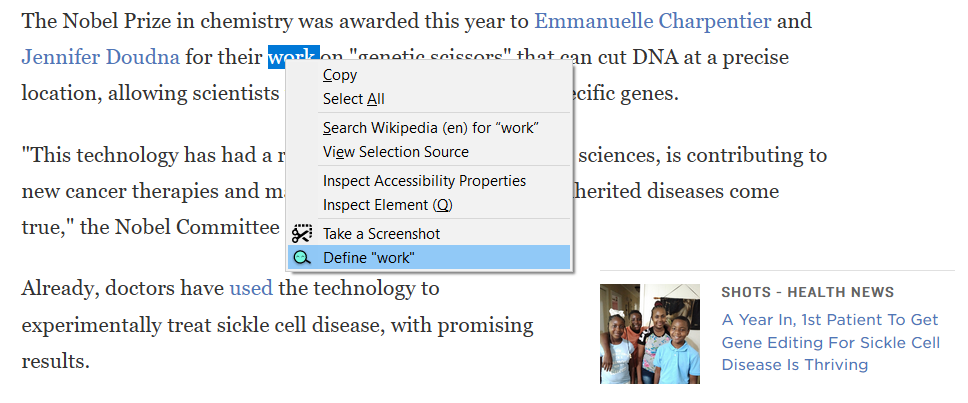
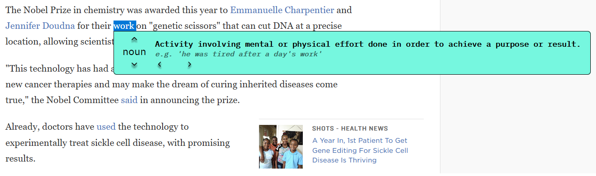

# TapeWord

> Browser extension that enables definition searches for highlighted terms via right-click context menu

## Tech

**TapeWord was developed and is maintained within the [Ubuntu 18.04.5 LTS](https://releases.ubuntu.com/18.04/) operating system, and requires [npm](https://github.com/npm/cli) to run the build script.**

The following open-source tools are used as _dev-dependencies_:

- [TypeScript `^3.9.5`](https://github.com/microsoft/TypeScript) - a superset of JavaScript that compiles to clean JavaScript output
- [webextension-polyfill-ts `^0.17.0`](https://github.com/Lusito/webextension-polyfill-ts) - a TypeScript ready "wrapper" for the WebExtension browser API Polyfill by Mozilla
- [css-loader `^3.6.0`](https://github.com/webpack-contrib/css-loader) - interprets `@import` and `url()` like `import/require()` and will resolve them
- [css-modules-typescript-loader `^4.0.0`](https://github.com/seek-oss/css-modules-typescript-loader) - a webpack loader to create TypeScript declarations for CSS Modules
- [url-loader `^4.1.0`](https://github.com/webpack-contrib/url-loader) - a loader for webpack which transforms files into base64 URIs
- [style-loader `^1.2.1`](https://github.com/webpack-contrib/style-loader) - used in conjunction with `style-loader` to inject CSS into the DOM
- [ts-loader `^7.0.5`](https://github.com/TypeStrong/ts-loader) - a TypeScript loader for webpack
- [webpack `^4.43.0`](https://github.com/webpack/webpack) - a bundler for javascript that packs many modules into a few bundled assets
- [webpack-cli `^3.3.11`](https://github.com/webpack/webpack-cli) - webpack's Command Line Interface
- [webpack-dev-server `^3.11.0`](https://github.com/webpack/webpack-dev-server) - serves a webpack app and updates the browser on changes
- [webpack-extension-reloader `^1.1.4`](https://github.com/rubenspgcavalcante/webpack-extension-reloader) - a webpack plugin to automatically reload browser extensions during development

## Build/Installation

Clone and enter the root directory of this repository

```sh
$ git clone https://github.com/kvnkm/TapeWord-Dictionary.git
$ cd TapeWord-Dictionary/
```

Install the dev-dependencies and run the build script command

```sh
$ npm install -D
$ npm run build
```

There should now be a new directory `dist/` in the root directory, with the minified JavaScript files ready to be used for installation in the browser.

- Please note- the recommended method of installing the extension for production is **directly** through the [Firefox](https://addons.mozilla.org/en-US/firefox/addon/tapeword-dictionary/) & Chrome (link TBA) marketplaces

## Usage

Once installed and activated, simply right-click on a highlighted term while web-browsing to search its definition, and click anywhere outside the TapeWord area to exit:




---

## MIT License

Copyright (c) 2020 kvnkm

Permission is hereby granted, free of charge, to any person obtaining a copy
of this software and associated documentation files (the "Software"), to deal
in the Software without restriction, including without limitation the ri ghts
to use, copy, modify, merge, publish, distribute, sublicense, and/or sell
copies of the Software, and to permit persons to whom the Software is
furnished to do so, subject to the following conditions:

The above copyright notice and this permission notice shall be included in all
copies or substantial portions of the Software.

THE SOFTWARE IS PROVIDED "AS IS", WITHOUT WARRANTY OF ANY KIND, EXPRESS OR
IMPLIED, INCLUDING BUT NOT LIMITED TO THE WARRANTIES OF MERCHANTABILITY,
FITNESS FOR A PARTICULAR PURPOSE AND NONINFRINGEMENT. IN NO EVENT SHALL THE
AUTHORS OR COPYRIGHT HOLDERS BE LIABLE FOR ANY CLAIM, DAMAGES OR OTHER
LIABILITY, WHETHER IN AN ACTION OF CONTRACT, TORT OR OTHERWISE, ARISING FROM,
OUT OF OR IN CONNECTION WITH THE SOFTWARE OR THE USE OR OTHER DEALINGS IN THE
SOFTWARE.
